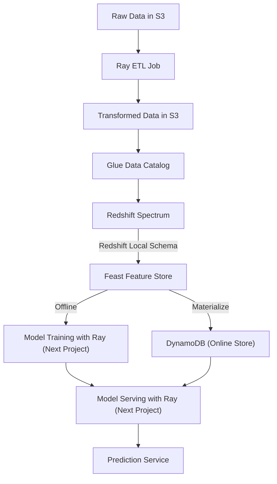

<div align="center">
  <h1>Feast Feature Store for Scalable ML Pipelines</h1>
  <p><b>End-to-end MLOps pipeline for feature engineering and (feature) serving using Feast, AWS and Ray</b></p>
</div>

---

## Overview

This project demonstrates a robust, production-grade MLOps pipeline leveraging [Feast](https://feast.dev/) as a feature store, AWS for scalable infrastructure and Ray for distributed ETL and training. The repository is designed to showcase best practices in feature engineering, versioning, and serving for machine learning systems.

## Features

- **Feature Store with Feast**: Centralized feature repository for versioning, schema validation, and point-in-time correctness.
- **Distributed ETL**: Scalable data processing using Ray.
- **Seamless AWS Integration**: S3, Glue, Redshift Spectrum, and DynamoDB for storage and compute.
- **Automated Orchestration**: (Planned) Airflow DAGs for automated ETL jobs and feast materialization.
- **Online & Offline Consistency**: Ensures features are consistent between training and inference.
- **Streaming Support**: (Planned) Real-time ingestion with Kafka and Flink.

## Architecture



## Project Structure

```
feast_test.ipynb           # Example notebook for Feast usage
preprocess.ipynb           # Data preprocessing pipeline
pyproject.toml             # Project dependencies
README.md                  # Project documentation
assets/                    # Supporting assets
feature_repo/              # Feast feature repository
  ├── data_sources.py      # Data source definitions
  ├── entities.py          # Entity definitions
  ├── feature_services.py  # Feature service definitions
  ├── feature_store.yaml   # Feast config
  ├── features.py          # Feature view definitions
ray/                       # Ray ETL and training jobs
  ├── ordinal_encoders.joblib
  ├── ray_job.py           # Distributed job definition
  ├── rayCluster.yaml      # Ray cluster in k8s
  └── README.md            # Ray documentation
```

## Setup & Configuration

### 0. Download Criteo Dataset
<details>
<summary>Expand for setup commands</summary>

```bash
# Create dataset folder
mkdir -p dataset
cd dataset

# Download the Criteo Attribution Dataset (about 1.5GB)
wget http://go.criteo.net/criteo-research-attribution-dataset.zip

# Unzip the dataset
unzip criteo-research-attribution-dataset.zip

# Extract the .tsv file from the .tsv.gz archive
gunzip -k *.tsv.gz

# (Optional) Remove the zip and gz files to save space
rm criteo-research-attribution-dataset.zip
rm *.tsv.gz

# Return to project root
cd ..
```
</details>

### 1. Define and Execute Ray ETL job
Later steps assume that raw data has been transformed with Ray. Follow these [steps](ray/README.md) to define the ETL pipeline.

### 2. AWS Glue Data Catalog
<details>
<summary>Expand for setup commands</summary>

```bash
# Create a Glue database
aws glue create-database --database-input '{"Name": "criteo_db"}' --region us-west-2

# Create IAM role for Glue
aws iam create-role \
  --role-name GlueRole \
  --assume-role-policy-document '{
    "Version": "2012-10-17",
    "Statement": [{
      "Effect": "Allow",
      "Principal": {"Service": "glue.amazonaws.com"},
      "Action": "sts:AssumeRole"
    }]
  }'
aws iam attach-role-policy --role-name GlueRole --policy-arn arn:aws:iam::aws:policy/AmazonS3ReadOnlyAccess
aws iam attach-role-policy --role-name GlueRole --policy-arn arn:aws:iam::aws:policy/service-role/AWSGlueServiceRole

ACCOUNT_ID=$(aws sts get-caller-identity --query Account --output text)
GLUE_ROLE_ARN="arn:aws:iam::${ACCOUNT_ID}:role/GlueRole"

# Create a crawler for S3 parquet partitions
aws glue create-crawler \
  --name criteo-crawler \
  --role $GLUE_ROLE_ARN \
  --database-name criteo_db \
  --region us-west-2 \
  --targets '{"S3Targets": [{"Path": "s3://<MY-BUCKET>/feast/criteo/transformed/features/"}]}' \
  --configuration '{"Version":1.0,"CrawlerOutput":{"Partitions":{"AddOrUpdateBehavior":"InheritFromTable"}}}'
aws glue start-crawler --name criteo-crawler --region us-west-2
```
</details>

### 3. Redshift Spectrum
<details>
<summary>Expand for setup commands</summary>

```bash
# Create IAM role for Redshift Spectrum
aws iam create-role \
  --role-name RedshiftSpectrumRole \
  --assume-role-policy-document '{
    "Version": "2012-10-17",
    "Statement": [{
      "Effect": "Allow",
      "Principal": {"Service": "redshift.amazonaws.com"},
      "Action": "sts:AssumeRole"
    }]
  }'
aws iam attach-role-policy --role-name RedshiftSpectrumRole --policy-arn arn:aws:iam::aws:policy/AmazonS3ReadOnlyAccess
aws iam attach-role-policy --role-name RedshiftSpectrumRole --policy-arn arn:aws:iam::aws:policy/AWSGlueConsoleFullAccess
aws iam attach-role-policy --role-name RedshiftSpectrumRole --policy-arn arn:aws:iam::aws:policy/AmazonS3FullAccess

ACCOUNT_ID=$(aws sts get-caller-identity --query Account --output text)
REDSHIFT_ROLE_ARN="arn:aws:iam::${ACCOUNT_ID}:role/RedshiftSpectrumRole"

# Create Redshift namespace and workgroup
aws redshift-serverless create-namespace \
  --namespace-name feast-namespace \
  --admin-username admin \
  --admin-user-password Feast123 \
  --db-name dev \
  --region us-west-2 \
  --iam-roles $REDSHIFT_ROLE_ARN \
  --default-iam-role-arn $REDSHIFT_ROLE_ARN
aws redshift-serverless create-workgroup \
  --workgroup-name feast-workgroup \
  --namespace-name feast-namespace \
  --region us-west-2 \
  --base-capacity 8

# (Optional) Set usage limits
WORKGROUP_ARN=$(aws redshift-serverless get-workgroup \
  --workgroup-name feast-workgroup \
  --region us-west-2 \
  --query 'workgroup.workgroupArn' \
  --output text)
aws redshift-serverless create-usage-limit \
  --resource-arn $WORKGROUP_ARN \
  --usage-type serverless-compute \
  --amount 20 \
  --period daily \
  --breach-action deactivate \
  --region us-west-2
```
</details>

### 4. External Schema Mapping
<details>
<summary>Expand for setup commands</summary>

```bash
ACCOUNT_ID=$(aws sts get-caller-identity --query Account --output text)
REDSHIFT_ROLE_ARN="arn:aws:iam::${ACCOUNT_ID}:role/RedshiftSpectrumRole"

aws redshift-data execute-statement \
    --workgroup-name feast-workgroup \
    --region us-west-2 \
    --database dev \
    --sql "CREATE EXTERNAL SCHEMA IF NOT EXISTS criteo FROM DATA CATALOG DATABASE 'criteo_db' \
    IAM_ROLE '${REDSHIFT_ROLE_ARN}' \
    REGION 'us-west-2';"

# Create a local table for Feast historical features
aws redshift-data execute-statement \
    --workgroup-name feast-workgroup \
    --region us-west-2 \
    --database dev \
    --sql "DROP TABLE IF EXISTS public.temp_feast_entities; \
           CREATE TABLE public.temp_feast_entities AS \
           SELECT * \
           FROM criteo.features \
           WHERE (year='2026' AND month='03' AND day='20');"
```
</details>

### 5. Feast Configuration
<details>
<summary>Expand for setup commands</summary>

```bash
# Install Feast
uv add 'feast[aws]==0.61'

# Initialize feature repository (edit feature_store.yaml as needed)
feast init -t aws

# Apply config and register features
feast apply

# Materialize features to online store
feast materialize 2026-03-20T00:00:00 2026-03-25T00:00:00
```
</details>

## Useful Resources

- [What Are Feature Stores: The Backbone of Scalable ML Systems](https://medium.com/write-a-catalyst/what-are-feature-stores-the-backbone-of-scalable-ml-systems-4fd9bf13080f)
- [Feast Documentation](https://docs.feast.dev)

---